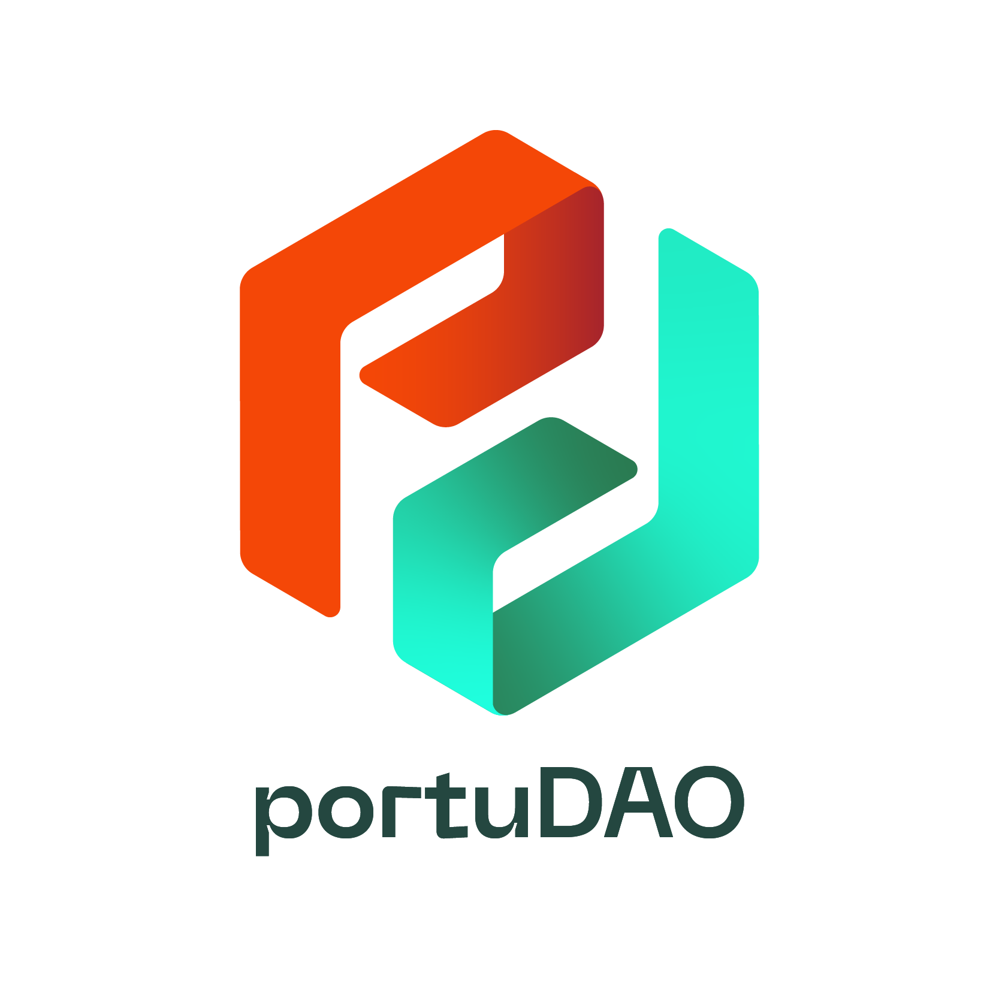

# logotipo e marca

Neste repositório encontras um conjunto de recursos gráficos da PortuDAO: **logotipos, manuais, imagens, fontes**, etc.

# manual de regras técnicas

Antes de usares o logotipo da **PortuDAO** recomendamos que dês uma vista de olhos no **[manual de normas gráficas](corporate-identity-manual/)** e **[nos casos de uso](corporate-identity-manual/portuDAO.pdf)** que foram testados de modo a assegurar que o resultado final está de acordo com as melhores espectativas.

# logotipo

Em [logotype](logotype/) encontras o logotipo e um conjunto de variantes possíveis.

# tipo de letra

O logotipo da portuDAO usa apenas a fonte [Poppins](typography/).
# changelog

* v1.0 2022/03/14 Primeira versão

# licença

MIT License
